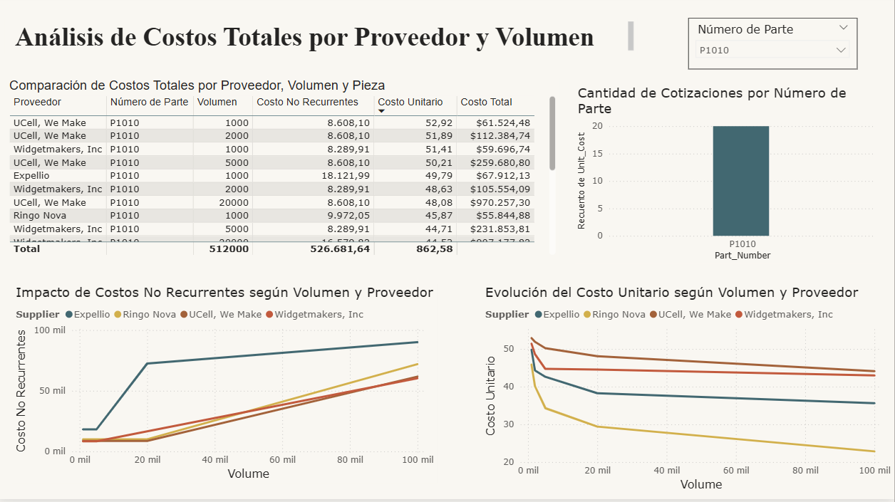
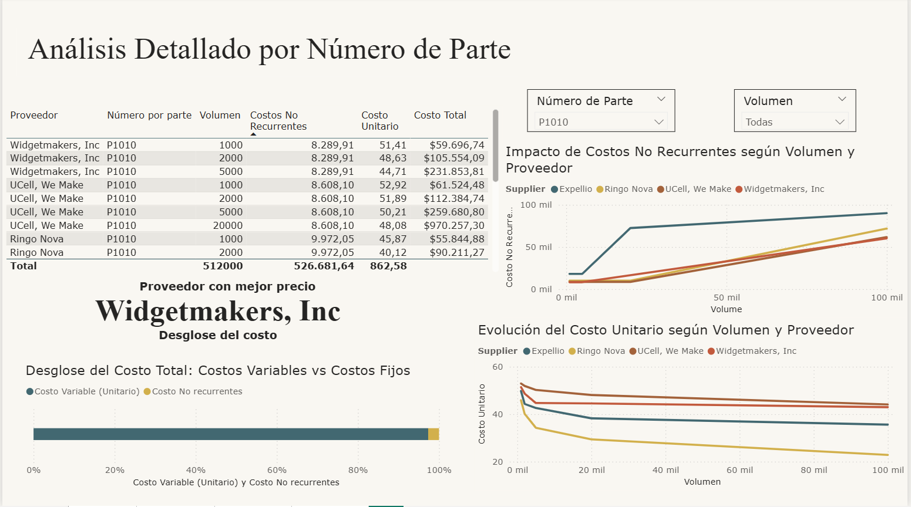
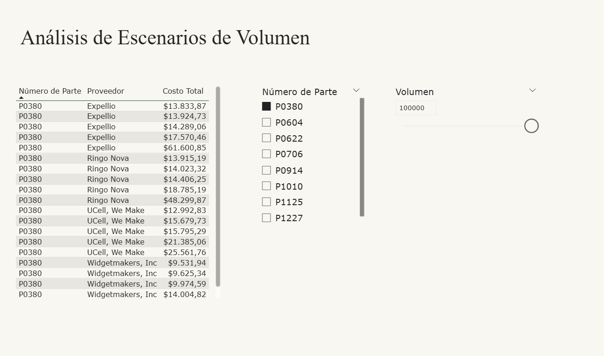

# Análisis de cadena de suministro con Power BI

Este proyecto analiza costos de producción y selección de proveedores utilizando Power BI.

## Objetivo
Evaluar el costo total en función del volumen de producción y comparar proveedores para optimizar decisiones de compra.

## Herramientas utilizadas
- Power BI
- DAX
- Modelado de datos

## Análisis realizados
- Comparación de costos por proveedor
- Evaluación de costos no recurrentes
- Análisis de escenarios de volumen
- Identificación del proveedor más rentable

## Resultados
Se identificó el proveedor óptimo según volumen y estructura de costos, mostrando cómo los costos unitarios disminuyen a mayor escala.

## Archivos
- Tablero inicial proveedores.pbix
- dashboard-general.png
- comparacion-proveedores-volumen.png
- analisis-escenarios-volumen.png

## Dashboard general

Este dashboard muestra la evolución del costo total según proveedor y volumen, permitiendo identificar economías de escala y tendencias de costos.

## Comparación de proveedores

Se comparan proveedores en distintos niveles de volumen para determinar cuál ofrece el menor costo total bajo diferentes escenarios.

## Análisis de escenarios de volumen

Se evalúan distintos escenarios de producción para analizar el impacto del volumen en la estructura de costos y la selección óptima de proveedor.
